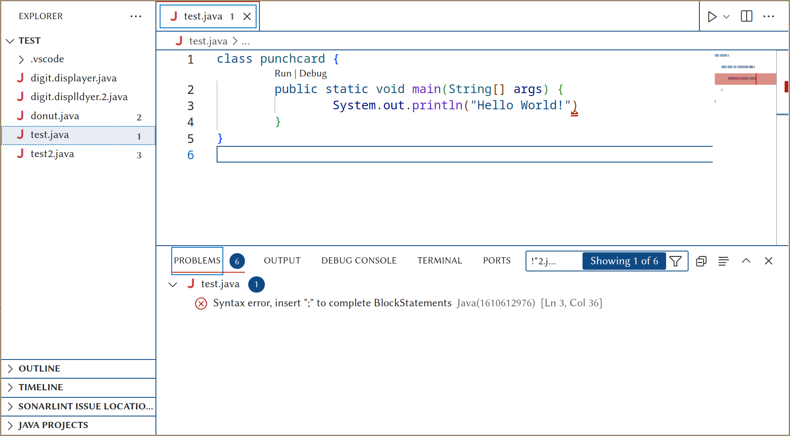
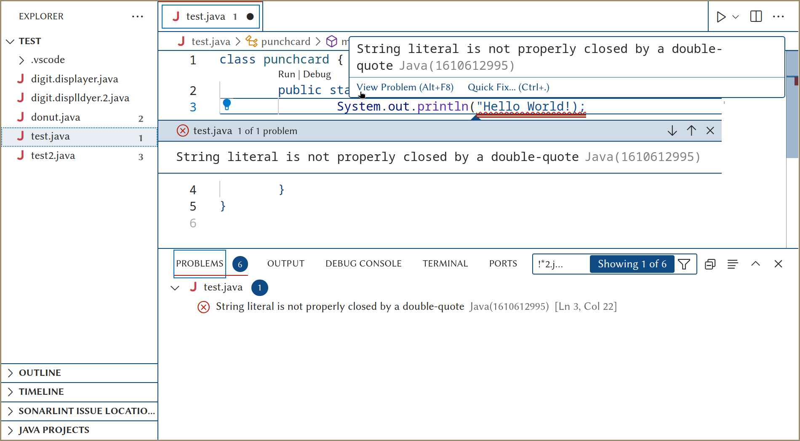
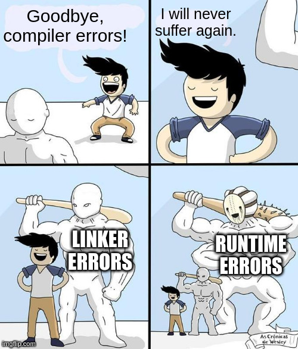
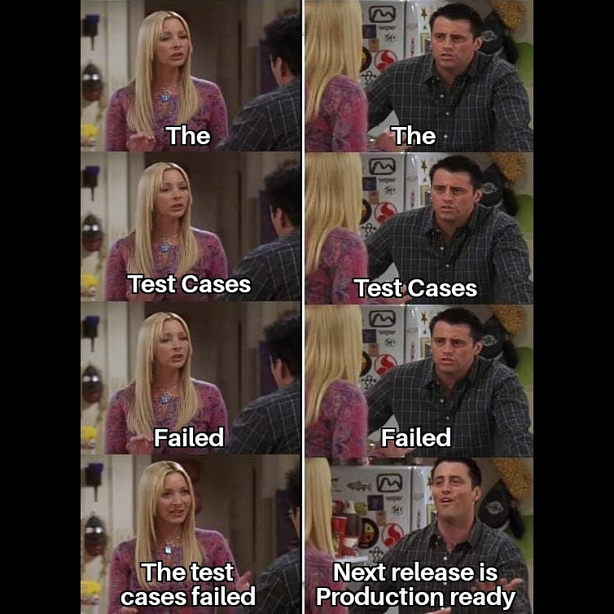
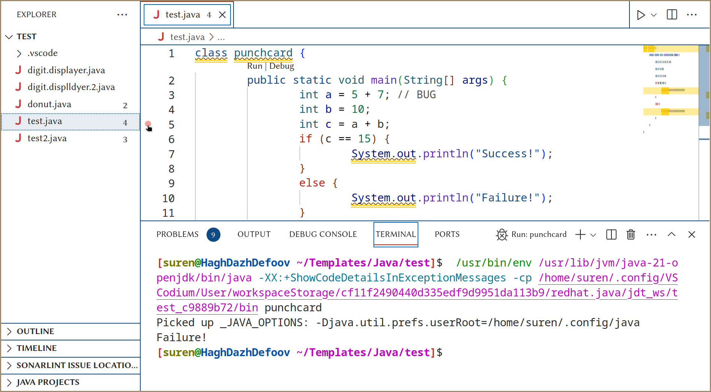
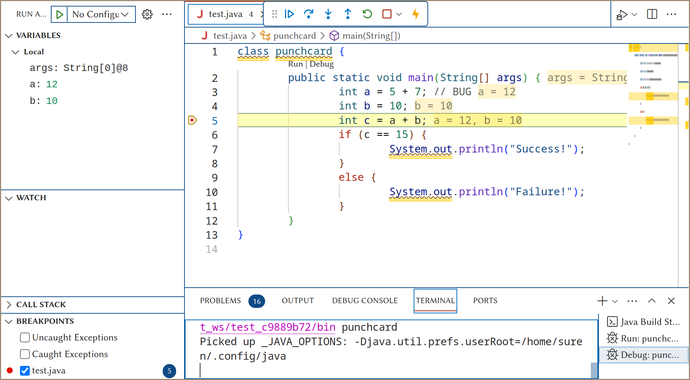
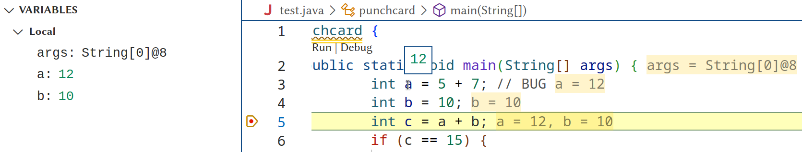
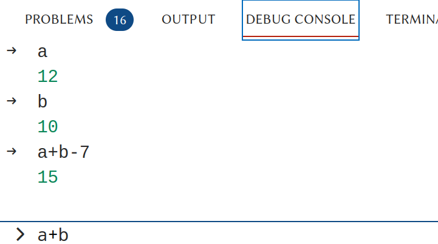
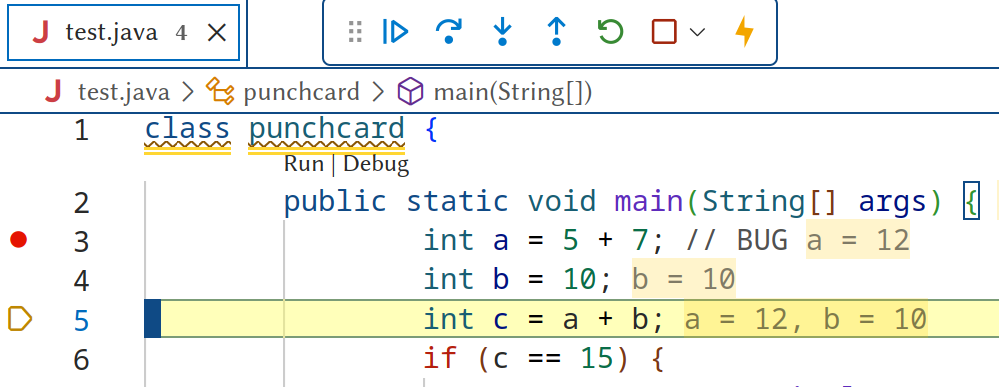

\pagebreak

# Giriş

İlk denemede her zaman mükemmel kod yazmıyoruz, değil mi?

{ width=50% }

Bu öğreticide, kodumuzdaki hataları anlamanın ve nasıl düzelteceğimizin yolunu öğreneceğiz.

\pagebreak

# Derleme zamanı hatalarını bulma

## Kodu derle

Java derleyicisi, kodunuzdaki sorunları size bildirmenin harika bir yoluna sahiptir.
Size satır numarasını ve sorunun türünü söyleyecek. Ayrıca aynı satırda birden fazla sorun olup olmadığını da belirtecek.

**Örnek:**

```java
class punchcard {
	public static void main(String[] args) {
		System.out.println("Hello World!")
	}
}
```

**Çıktı:**

```bash
/home/suren/Templates/Java/test/test.java:3: error: ';' expected
                System.out.println("Hello World!")
                                                  ^
1 error
error: compilation failed

shell returned 1
```

* Çıktıyı inceleyelim ve ne anlama geldiğini anlayalım.

```bash
/home/suren/Templates/Java/test/test.java
```

Bu, hataya sahip olan dosyanın yoludur.

Bu, hataya sahip olan dosyayı tanımlamanıza yardımcı olur.

Dosya adını görmek için sonuna bakın.

Dosya adı `test.java`'dır.

* Çıktıya devam edelim.

```bash
:3: error:
```

Bu çıktının bu kısmı hatanın satır numarasını söyler.

IDE'nin editörünün sol tarafındaki satır numarasını görebilirsiniz.

Satır numarasını `3` olarak görebilirsiniz.

* Çıktıya devam edelim.

```bash
';' expected
```

Bu çıktının bu kısmı sorunun ne olduğunu söyler.

Bu durumda, size bir **noktalı virgül** eksik olduğunu söylüyor.

Alabileceğiniz birçok başka hata var. Bu hataların bazıları kolay anlaşılırken bazıları kriptiktir. :b

Hatanın anlaşılmadığı bir durumda, **internet** üzerinde arayabilirsiniz. Unutmayın, bir programcı olarak İnternet en iyi dostunuzdur.

* Çıktıya devam edelim.

```bash
System.out.println("Hello World!")
__________________________________^
```

Bu, Java derleyicisinin muhteşem bir özelliğidir. Hatanın tam konumunu size söyler.

Bu sayede uzun bir kod satırında hatanın nerede olduğunu merak etmenize gerek kalmaz.

* Çıktıya devam edelim.

```bash
1 error
```

Bu çıktının bu kısmı kodunuzdaki hataların sayısını söyler.

Evet, Java derleyicisi kodunuzda birden fazla hata olup olmadığını size söyleyebilir.

Bu durumda, yalnızca bir hata vardır.

* Çıktıya devam edelim.

```bash
error: compilation failed
```

Bu çıktının bu kısmı hatanın türünü söyler.

Bu durumda, derlemenin başarısız olduğunu söylüyor.

* Çıktıya devam edelim.

```bash
shell returned 1
```

Bu satır Java derleyicisinin çıktısının bir parçası değildir.

Bu satır, kabuğun çıktısıdır.

Ancak kabuğun hala 1 döndüğünü bilmek yine de faydalıdır.

0 değeri dönüş, programın başarıyla çalıştığını gösterir.

1 değeri dönüş, programın çalışmada başarısız olduğunu gösterir.

Burada 1 değeri, programın derlemede başarısız olduğunu gösterir.

### Diğer örnekler

**Örnek:**

```java
class punchcard {
	public static void main(String[] args) {
		System.out.println("Hello World!");

}
```

**Çıktı:**

```bash
/home/suren/Templates/Java/test/test.java:5: error: reached end of file while parsing
}
 ^
1 error
error: compilation failed
```

> dosya adı: `test.java`

> satır numarası: `5`

> hata: `parsing sırasında dosya sonuna ulaşıldı`

> hata sayısı: `1`

> hata türü: `derleme başarısız`

> eksik: `}`

**Örnek:**

```java
class punchcard {
	public static void main(String[] args) {
		System.out.println("Hello World!");
	}
}
```

**Çıktı:**

```bash
/home/suren/Templates/Java/test/test.java:3: error: ')' or ',' expected
                System.out.println("Hello World!";
                                                 ^
1 error
error: compilation failed
```

> dosya adı: `test.java`

> satır numarası: `3`

> hata: `')' veya ',' bekleniyor`

> hata sayısı: `1`

> hata türü: `derleme başarısız`

> eksik: `)`

**Örnek:**

```java
class punchcard {
	public static void main(String[] args) {
		System.out.println("Hello World!");
		not_read_code_sitting_here;
	}
}
```

**Çıktı:**

```bash
/home/suren/Templates/Java/test/test.java:4: error: not a statement
                not_read_code_sitting_here;
                ^
1 error
error: compilation failed
```

> dosya adı: `test.java`

> satır numarası: `4`

> hata: `bir ifade değil`

> hata sayısı: `1`

> hata türü: `derleme başarısız`

> bu kod geçerli bir ifade değil.

**Örnek:**

```java
class punchcard {
	public static void main(String[] args) {
		System.out.println("Hello World!")
		System.out.println("Hello Second World!);
	}
}
```

**Çıktı:**

```bash
/home/suren/Templates/Java/test/test.java:3: error: ';' expected
                System.out.println("Hello World!")
                                                  ^
/home/suren/Templates/Java/test/test.java:4: error: unclosed string literal
                System.out.println("Hello Second World!);
                                   ^
2 errors
error: compilation failed
```

> dosya adı: `test.java`

> satır numarası: `3` ve `4`

> hata: `';' bekleniyor` ve `kapatılmamış dize alıntısı`

> hata sayısı: `2`

> hata türü: `derleme başarısız`

> eksik: `;` ve `"`

{ width=60% }

\pagebreak

## IDE'nin Dil Sunucusu Protokolü

En popüler IDE'ler **Dil Sunucusu Protokolü**'nü destekler.

Bu özellik, kodunuzda yazarken hataları görmemizi sağlar.

Bu özellikle kodunuzu derlemeden hataları görebilmenizi sağlar.



Bir LSP'nin, kodunuzdaki hataları göstermek için birçok göstergesi vardır.

* Gezgin Paneli

Sol taraftaki gezgin paneline bakın.
Dosya adının yanında bir sayı var.

Bu sayı, dosyadaki hata sayısını size gösterir.

* Mini Harita

Şekil 3'ün sağ üstündeki minik haritaya bakın.
Minik haritada kırmızı bir çizgi var.

Bu kırmızı çizgi, dosya içindeki hatanın genel konumunu gösterir.

Bu, uzun bir dosyadaki hataları bulmaya yardımcı olabilir.

* Hata Paneli

IDE'nin alt kısmında bir panel var.
Bu panelin birçok kullanışlı sekmesi var. Şimdiye kadar sadece **TERMINAL** sekmesini kullandık.

Şimdi, **PROBLEMLER** sekmesine bakalım.

Bu sekme, kodunuzdaki hataları liste formatında gösterir.

Kırmızı çarpı-daireye tıklarak hataya sahip olan satıra gidebilirsiniz.

Listede bulunan hatayı sağ tıklayarak hatayı kopyalayabilirsiniz. Bu, hatayı internette aramak isterseniz faydalı olabilir.

Hata mesajının sonunda bir dizi sayı var.

```java
[Satır 3, Sütun 36]
```

'Ln', hatanın satır numarasını belirtir. (satır 3)
'Col', hatanın sütun numarasını belirtir. (sütun 36)

* Kırmızı Alt Çizgi

Şekil 3'teki kırmızı alt çizgiye bakın.
Tam olarak 3. satırdaki ')' altında.

Kırmızı alt çizginin üzerine geldiğinizde, hatanın mesajını göreceksiniz.
Bazı IDE'ler ayrıca hatayla ilgili daha fazla bilgi gösterebilir.
Şekil 4'e bakın.

Bu hataya yönelik bir hızlı düzeltme bile mevcut.
Hızlı düzeltme, hatayı düzeltmek için size bir öneri sunar.
Kodla uğraşmanıza gerek olmayabilir.



\pagebreak

Bu araçlarla kodunuzdaki herhangi bir çalışma zamanı hatasını kolayca bulabiliriz.

{ width=50% }

\pagebreak

# Çalışma zamanı ve mantıksal hataları bulma

## Yazdırma ifadeleri

İnsanlık programlamayı öğrendiği günden beri kodlarını hata ayıklamak için yazdırma ifadelerini kullanıyor.

Bu, kodunuzu hata ayıklamanın en zarif olmayan yolu olabilir, ancak küçük programları hata ayıklamanın en etkili yoludur.

Aşağıdaki kodu inceleyin.

```java
class punchcard {
	public static void main(String[] args) {
		int a = 5 + 7; // HATA
		int b = 10;
		int c = a + b;
		if (c == 15) {
			System.out.println("Başarılı!");
		}
		else {
			System.out.println("Başarısız!");
		}
	}
}
```

Diyelim ki `a`'nın değerinin 5 ve `b`'nin değerinin 10 olmasını bekliyorduk.
Sonuç olarak, `c`'nin değerinin 15 olmasını bekliyorduk. Ancak bir nedenden dolayı `c`'nin değeri 15 değil.

Yapabileceğimiz ilk şey, `c`'nin değerini görmek için `c`'nin değerini yazdırmak.

```java
class punchcard {
	public static void main(String[] args) {
		int a = 5 + 7; // HATA
		int b = 10;
		int c = a + b;
		System.out.println(c); // HATA
		if (c == 15) {
			System.out.println("Başarılı!");
		}
		else {
			System.out.println("Başarısız!");
		}
	}
}
```

**Çıktı:**

```bash
22
Başarısız!
```

Artık `c` değerinin 22 olduğunu biliyoruz. Ancak `c` değerinin neden 22 olduğunu hâlâ bilmiyoruz.

`a` ve `b` değerlerini görüntüleyerek `a` ve `b` değerlerinin ne olduğunu görelim.

```java
class punchcard {
    public static void main(String[] args) {
        int a = 5 + 7; // HATA
        System.out.println(a); // HATA
        int b = 10;
        System.out.println(b); // HATA
        int c = a + b;
        System.out.println(c); // HATA
        if (c == 15) {
            System.out.println("Başarılı!");
        }
        else {
            System.out.println("Başarısız!");
        }
    }
}
```

**Çıktı:**

```bash
12
10
22
Başarısız!
```

Anladık! `a` değeri 12 olduğu için `c` değeri 22. Bu hatayı düzeltebiliriz, `a` değerini 5'e değiştirerek.

Hatayı düzelttikten sonra, kodunuzu temiz tutmak için `System.out.println()` gibi yazdırma ifadelerini kaldırmayı unutmayın.

```java
class punchcard {
    public static void main(String[] args) {
        int a = 5;
        int b = 10;
        int c = a + b;
        if (c == 15) {
            System.out.println("Başarılı!");
        }
        else {
            System.out.println("Başarısız!");
        }
    }
}
```

**Çıktı:**

```bash
Başarılı!
```

\pagebreak

## Birim test veya test durumları

Eğer girdiler basit değilse veya tüm kenar durumları bilmiyorsanız ne yapacaksınız?

Bu durumda, kodunuzu test etmek için birim testleri kullanabilirsiniz.
Birim testleri, kodunuzu test etmenin bir yoludur, kod yazarak.

Ancak, birim testi konusu bu öğretici kapsamının dışındadır.
Ayrıca, birim testleri Java'nın daha fazla bilgisini gerektirir.

Birim testi, küçük bir kodu hata ayıklamak için tercih edilmez.

Birim testleri, sadece geliştiriciye beklenmeyen bir davranışın meydana geldiğini bildirir.
Sorunun nedeni hakkında bilgi vermez.

Ancak test durumları, birden fazla geliştirici tarafından geliştirilen büyük projelerin önemli bir parçasıdır.

Kodun beklenildiği gibi çalıştığından emin olur.

{ width=70% }

\pagebreak

## Hata Ayıklayıcılar

İşte sizi saatlerce hata ayıklamaktan kurtarabilecek en güçlü araç.

Hata ayıklayıcılar, kodunuzu satır satır çalıştırmanıza izin veren araçlardır.

Her kod satırındaki değişken değerini görebilirsiniz.

Adı sizi aldatmasın. Hata ayıklayıcılar sadece hata ayıklamak için kullanılmaz.
Hata ayıklayıcılar harika:

1. **Yabancı bir kodun nasıl çalıştığını anlama.** Kodu satır satır çalıştırabilir ve her kod satırının ne yaptığını görebilirsiniz. Değerlerin nasıl değiştiğini gözlemleyebilirsiniz.
2. **Bir hatanın nedenini bulma.** Kodu satır satır çalıştırabilir ve kodun beklenildiği gibi çalışmadığı yeri görebilirsiniz. Hangi değerin beklenildiği gibi olmadığını görebilirsiniz.
3. **Kodunuzu test etme.** Kodu satır satır çalıştırabilir ve kodun işe yarayıp yaramadığını görebilirsiniz. Kodun doğru sonucu verdiği ancak problemi çözmenin doğru yol olmadığı zamanlar vardır. Hata ayıklayıcılar bu tür problemleri bulmanıza yardımcı olabilir.

### Hata ayıklayıcılarının temelleri

Öncelikle, hata ayıklayıcıların vazgeçilmez unsuru olan **kesme noktalarını (breakpoints)** öğrenelim.

* **Kesme Noktaları**

Kesme noktaları, kodunuzun yürütülmesini durdurmak istediğiniz noktalardır.

Bir kesme noktası belirlemek için satır numarasının sol tarafına tıklayarak belirleyebilirsiniz. Şekil 6.



Bu örneğe bakın.

**Örnek:**

```java
class punchcard {
    public static void main(String[] args) {
        int a = 5 + 7; // HATA
        int b = 10;
        int c = a + b;
        if (c == 15) {
            System.out.println("Başarılı!");
        }
        else {
            System.out.println("Başarısız!");
        }
    }
}
```

Diyelim ki, `if`{.java} ifadesinden önce `a` ve `b` değerlerini görmek istiyorsunuz. 5. satıra bir kesme noktası belirleyebilir ve **hata ayıklama (debug)** düğmesine tıklayabilirsiniz. Şekil 8.

{ width=25% }



Bu bir hata ayıklama oturumu. Şekil 9.

Hata ayıklayıcının birçok kullanışlı aracı vardır. Bunları tek tek gözden geçirelim.

Ancak öncelikle, bir Java programının akışını anlayalım.

Şimdilik, `

`public static void main(String[] args)`{.java} içinde, kodunuzun üstten alta doğru satır satır çalıştığını bilmemiz yeterli.

#### Adım Göstergesi

{ width=25% }

Bu kahverengi sekizgen-ok işaretli düğme, **adım göstergesi**dir. Şekil 10.

Bu düğme, bir sonraki yürütülecek kod satırını gösterir.
Kod, adım göstergesinde gösterilen satırda durur.

Şimdi, `c = a + b;`{.java} ifadesinden önceki tüm bilgileri görebiliriz.

#### Değişkenler

Akışın durduğu noktadan önce değişken değerlerini görmek için birden fazla yol vardır. Şekil 11.



* **Değişkenler Paneli**

Solda, değişkenler panelini görebilirsiniz. Akışın durduğu noktadan önceki tüm değerler bu panoda gösterilir.

* **Üzerine gelme**

Değerinizi görmek için değişkenin üzerine gelip değeri görebilirsiniz. 3. satırdaki `a`{.java} üzerine gelerek `12`{.java} değerini görebilirsiniz.

* **İçinde İpucu (Inlay hints)**

Değişkenlerin değerleri, gerçek kodun hemen sonrasında gri renkli metin olarak gösterilir.

* **Hata Ayıklama Konsolu**

Değişkenin değerini hata ayıklama konsolunda çağırabilirsiniz. Şekil 12.

Bir değişkenin değerini görmek için `System.out.println()`{.java} kullanmaya gerek yoktur. Sadece hata ayıklama konsolunda değişken adını yazın ve enter tuşuna basın.



#### Hata Ayıklama Araç Çubuğu

Şimdi, 10. satıra bir kesme noktası ekleyelim. Bu ikinci kesme noktasını bu bölümde daha sonra kullanacağız.

{ width=50% }

Bu, hata ayıklama araç çubuğudur. Şekil 13.

Soldan sağa:

* **Devam Et (Continue)**

Bu düğme, bir sonraki kesme noktasına kadar kodun yürütülmesini sağlar. Unutmayın, yürütme akışı, adım göstergesi tarafından belirtilen satırda durur, bu yüzden `System.out.println("Başarısız!")`{.java} henüz çalıştırılmadı. Şekil 14.


* **Üzerinden Atlama (Step Over)**

Bu düğme, kodun bir sonraki satırında yürütme akışını durdurur. Bir sonraki satırda bir kesme noktası olsa da olmasa da fark etmez.

Örneğin, 3. satıra bir kesme noktası koyabilir ve **üzerinden atlama** düğmesine tıklayabilirsiniz. Yürütme akışı, 4. satırda durur. Bir sonraki düğme basımı, yürütme akışını 5. satırda durdurur. Şekil 15.



* **İçine Gir (Step Into)**

Bu düğmenin eylemi, **üzerinden atlama** düğmesinin benzeridir. Farkı bu öğretici kapsamı dışındadır. (Yöntem hata ayıklamak için kullanışlıdır)

* **Dışına Çık (Step Out)**

Bu düğmenin eylemi bu öğretici kapsamı dışındadır. (Yöntem hata ayıklamak için kullanışlıdır)

* **Yeniden Başlat (Restart)**

Bu düğme, hata ayıklama oturumunu yeniden başlatır. Birden fazla kez kodu hata ayıklamak isterseniz veya kodu değiştirdiyseniz ve kodu tekrar hata ayıklamak istiyorsanız kullanışlıdır.

* **Durdur (Stop)**

Bu düğme, hata ayıklama oturumunu durdurur. Ayrıca hata ayıklama aracını keser, böylece IDE'nin normal moduna geri dönebilir ve kodu normal şekilde çalıştırabilirsiniz.

#### Kesme Noktaları

Normalde, bir kesme noktasına artık ihtiyacınız yoksa, onu tıklayarak kaldırabilirsiniz, ancak bazen kesme noktasını korumak isteyebilirsiniz, ancak yürütme akışını durdurmak istemezsiniz. (şimdilik)

Bu durumda, kesme noktasını devre dışı bırakabilirsiniz. Şekil 16.


{ width=50% }

\pagebreak

### Gelişmiş Hata Ayıklama

Hata ayıklayıcıların birçok daha gelişmiş özelliği var. Ancak bu özellikler bu öğretici kapsamının dışındadır, Ancak burada bazılarını belirtiyorum.

Certainly! Here is the translation of the document into Turkish:

#### Koşullu kesme noktaları

Normalde, hata ayıklayıcı istediğiniz noktada durur. Bir döngü içindeyseniz veya sorunu tetikleyen değerleri biliyorsanız, bunu istemezsiniz. Koşullu bir kesme noktası, kesme noktanıza biraz Java kodu eklemenizi sağlar, böylece yalnızca o koşul doğru olduğunda durur. Bu yaklaşım, önemsediğiniz değere ulaşana kadar defalarca devam etmekten kaçınmanızı sağlar.

Bu özellik özellikle döngülerin hata ayıklanmasında kullanışlıdır.

#### İzleme Noktaları

İzleme noktaları kesme noktalarına benzer. Ancak, yürütmenin akışını durdurmak yerine, değişkenin değerini yalnızca yazdırırlar.

Bu, print ifadelerini kullanmaktan daha iyidir çünkü hatayı düzelttikten sonra izleme noktasını kaldırmanız gerekmez.

#### Değişken Değerlerini Değiştirme

Hata ayıklayıcıda değişken değerlerini manuel olarak değiştirebilir ve kodun, orijinal değer yerine yeni değerle devam etmesini sağlayabilirsiniz.

Bu, kodu değiştirmeden potansiyel düzeltmeleri test etmenize yardımcı olur.

\pagebreak

# Sonuç

Hata ayıklama, bir programcının en önemli becerilerinden biridir. Her gün kullanacağınız bir beceridir. Her projede kullanacağınız bir beceridir.

Öğrenin, Kullanın, Ustalaşın.

Ve her zamanki gibi, Mutlu kodlamalar!

\pagebreak

Bu adam olmayın!

{ width=50% }

\pagebreak

Bu adam olun!

{ width=50% }

\pagebreak

# Belgelendirme

Her IDE'nin kendi hata ayıklayıcısı bulunmaktadır. Bu nedenle hata ayıklayıcıların belgelendirmesi her IDE için farklıdır.

IDE'nizin belgelendirmesine giderek hata ayıklayıcılar hakkında daha fazla bilgi edinebilirsiniz.

* [IntelliJ IDEA](https://www.jetbrains.com/help/idea/debugging-your-first-java-application.html)
* [Eclipse](https://www.eclipse.org/community/eclipse_newsletter/2017/june/article1.php)
* [NetBeans](https://netbeans.apache.org/tutorial/main/kb/docs/java/debug-visual/)
* [Visual Studio Code](https://code.visualstudio.com/docs/editor/debugging)
* [vim](https://www.youtube.com/watch?v=dQw4w9WgXcQ)
