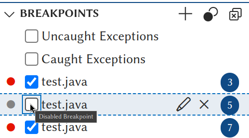
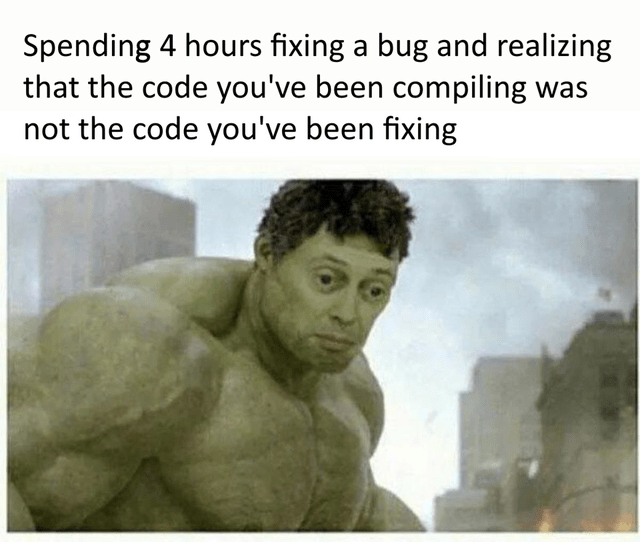

\pagebreak

# Introduction

We all write perfect code on first attempt, right?

{ width=50% }

In this tutorial, we will learn how to understand the errors
in our code and how to fix them.

\pagebreak

# How to find compile time errors

## Compile the code

The Java compiler has a great way of informing you of problems in your code.
It will tell you the line number and the type of problem. It will also tell
you if there are multiple problems on the same line.

**Example:**

```java
class punchcard {
	public static void main(String[] args) {
		System.out.println("Hello World!")
	}
}
```

**Output:**

```bash
/home/suren/Templates/Java/test/test.java:3: error: ';' expected
                System.out.println("Hello World!")
                                                  ^
1 error
error: compilation failed

shell returned 1
```

* Let's go over the ouput and undrestand what it means.

```bash
/home/suren/Templates/Java/test/test.java
```

This is the path to the file that has the error.

This help you identify the file that has the error.

Look at the end of it to see the file name.

The file name is `test.java`.

* Let's continue with the output.

```bash
:3: error:
```

This part of the output tells you the line number of error.

You can see the number of line in the left of side of IDE's editor.

So you can go to the line number and see what the problem is.

The line number is `3`.

* Let's continue with the output.

```bash
';' expected
```

This part of the output tells you what the problem is.

In this case, it is telling you that you are missing a **semicolon**.

There are many other errors that you can get. Some of These errors
are easily understandable and some of them are cryptic. :b

In a case you can't understand the error, you can search it on the
**internet**. Remember, as a programmer, The internet is your best
friend.

* Let's continue with the output.

```bash
System.out.println("Hello World!")
__________________________________^
```

This is an amazing feature of the Java compiler. It tells you the
exact location of the error.

So no more wondering where the error is in a long line of code.

* Let's continue with the output.

```bash
1 error
```

This part of the output tells you the number of errors in your code.

Yes Java compiler can tell you if there are multiple errors in your code.

In this case, there is only one error.

* Let's continue with the output.

```bash
error: compilation failed
```

This part of the output tells you the type of error.

In this case, it is telling you that the compilation failed.

* Let's continue with the output.

```bash
shell returned 1
```

This line is not part of the Java compiler output.

This line is the output of the shell.

But it is still useful to know that the shell returned 1.

A return value of 0 means that the program ran successfully.

A return value of 1 means that the program failed to run.

Here value of 1 means that the program failed to compile.

### other examples

**Example:**

```java
class punchcard {
	public static void main(String[] args) {
		System.out.println("Hello World!");

}
```

**Output:**

```bash
/home/suren/Templates/Java/test/test.java:5: error: reached end of file while parsing
}
 ^
1 error
error: compilation failed
```

> file name: `test.java`

> line number: `5`

> error: `reached end of file while parsing`

> number of errors: `1`

> type of error: `compilation failed`

> missing: `}`

**Example:**

```java
class punchcard {
	public static void main(String[] args) {
		System.out.println("Hello World!";
	}
}
```

**Output:**

```bash
/home/suren/Templates/Java/test/test.java:3: error: ')' or ',' expected
                System.out.println("Hello World!";
                                                 ^
1 error
error: compilation failed
```

> file name: `test.java`

> line number: `3`

> error: `')' or ',' expected`

> number of errors: `1`

> type of error: `compilation failed`

> missing: `)`

**Example:**

```java
class punchcard {
	public static void main(String[] args) {
		System.out.println("Hello World!");
		not_read_code_sitting_here;
	}
}
```

**Output:**

```bash
/home/suren/Templates/Java/test/test.java:4: error: not a statement
                not_read_code_sitting_here;
                ^
1 error
error: compilation failed
```

> file name: `test.java`

> line number: `4`

> error: `not a statement`

> number of errors: `1`

> type of error: `compilation failed`

> this code is not a valid statement.

**Example:**

```java
class punchcard {
	public static void main(String[] args) {
		System.out.println("Hello World!")
		System.out.println("Hello Second World!);
	}
}
```

**Output:**

```bash
/home/suren/Templates/Java/test/test.java:3: error: ';' expected
                System.out.println("Hello World!")
                                                  ^
/home/suren/Templates/Java/test/test.java:4: error: unclosed string literal
                System.out.println("Hello Second World!);
                                   ^
2 errors
error: compilation failed
```

> file name: `test.java`

> line number: `3` and `4`

> error: `';' expected` and `unclosed string literal`

> number of errors: `2`

> type of error: `compilation failed`

> missing: `;` and `"`

{ width=60% }

\pagebreak

## IDE's Language Server Protocol

Most popular IDE's support the **Language Server Protocol**.

This feature allows you to see the errors in your code as you type.

With this feature, you don't have to compile your code to see the errors.


An LSP has many indicators to show you the errors in your code.

* Explorer Panel

Look at the explorer panel on the left side.
There is a number next to the file name.

This number shows you the number of errors in the file.

* Mini Map

Look at the mini map on the top right side of Figure 3.
There is a red line on the mini map.

This red line shows you the general location of the error
within the file.

This can help to find the errors in a long file.

* Error Panel

In the bottom of the IDE, there is a panel.
This panel has many useful tabs. Up until now, we have
only used the **TERMINAL** tab.

Now, let's look at the **PROBLEMS** tab.

This tab shows you the errors in your code in a list format.

You can click on the red cross-circle to go to the line that
has the error.

You can copy the error message by right-clicking on the error
that is in the list. This can be useful if you want to search
the error on the internet.

At the end of the error message, there is a set of numbers.
```java
[Ln 3, Col 36]
```
The 'Ln' tells you the line number of the error. (line 3)
The 'Col' tells you the column number of the error. (column 36)

* Red underline

Look at the red underline in the Figure 3.
Exactly under the ')' in the line 3.

If you hover over the red underline, you will see the error
message. Some IDE also show more information about the error.
Look at the Figure 4.

There's even a quick fix available for this error.
The quick fix gives you a suggestion to fix the error.
You might not need to get your hands dirty with the code.


\pagebreak

With these tools we can easily find any runtime errors in code.

{ width=50% }

\pagebreak

# How to find runtime and logical errors

## print statements

As long as mankind learned the art of programming, they have
used print statements to debug their code.

It's the least elegant way to debug your code, but it's the
most effective way to debug small programs.

Look In the following code.

```java
class punchcard {
	public static void main(String[] args) {
		int a = 5 + 7; // BUG
		int b = 10;
		int c = a + b;
		if (c == 15) {
			System.out.println("Success!");
		}
		else {
			System.out.println("Failure!");
		}
	}
}
```

Let's say we expected th value of `a` to be 5 and `b` to be 10.
As a result, we expected the value of `c` to be 15. But for some
reason, the value of `c` is not 15.

First thing we can do is to print the value of `c` to see what
the value of `c` is.

```java
class punchcard {
	public static void main(String[] args) {
		int a = 5 + 7; // BUG
		int b = 10;
		int c = a + b;
		System.out.println(c); // BUG
		if (c == 15) {
			System.out.println("Success!");
		}
		else {
			System.out.println("Failure!");
		}
	}
}
```

**Output:**

```bash
22
Failure!
```

Now we know that the value of `c` is 22. But we still don't know
why the value of `c` is 22.

Let's print the value of `a` and `b` to see what the value of
`a` and `b` are.

```java
class punchcard {
	public static void main(String[] args) {
		int a = 5 + 7; // BUG
		System.out.println(a); // BUG
		int b = 10;
		System.out.println(b); // BUG
		int c = a + b;
		System.out.println(c); // BUG
		if (c == 15) {
			System.out.println("Success!");
		}
		else {
			System.out.println("Failure!");
		}
	}
}
```

**Output:**

```bash
12
10
22
Failure!
```

Gotcha! The value of `a` is 12. That's why the value of `c` is 22. We can fix
the bug by changing the value of `a` to 5.

Don't forget to remove the print statements after you fix the bug. Just to keep
your code clean.

```java
class punchcard {
	public static void main(String[] args) {
		int a = 5;
		int b = 10;
		int c = a + b;
		if (c == 15) {
			System.out.println("Success!");
		}
		else {
			System.out.println("Failure!");
		}
	}
}
```

**Output:**

```bash
Success!
```

\pagebreak

## Unit testing or test cases

What if the inputs are not as simple, or you might not know all the edge cases?

In this case, you can use unit testing to test your code.
Unit testing is a way to test your code by writing code.

However, The topic of unit testing is beyond the scope of this tutorial.
Besides, writing unit tests needs more knowledge of Java.

Unit test is not preferred for debugging small code.

Unit tests just inform the developer that an unexpected behavior has occurred.
It gives no information about the cause of the problem.

But test cases are one of the crucial parts of big projects that are developed
by multiple developers.

It ensures that the code is working as expected.

{ width=70% }

\pagebreak

## Debuggers

Here comes the most powerful tool that can save you hours of debugging.

Debuggers are tools that allow you to run your code line by line.

You can see the value of variables at each line of code.

Don't let Its name deceive you. Debuggers are not only used for debugging.
Debuggers are great for:

1. **Understanding how an unfamiliar code works.** You can run the code line by
line and see what each line of code does. Watching how values change.
2. **Finding the cause of a bug.** You can run the code line by line and see
where the code is not working as expected. What value is not as expected.
3. **Testing your code.** You can run the code line by line and see if the code.
There are times that a code works and outputs the correct result, but it's not
the correct way to solve the problem. Debuggers can help you find these problems.

### Basics of debuggers

First let's learn the bread and butter of debuggers. THE **breakpoints**.

* **Breakpoints**

Breakpoints are the points in your code that you want to stop the execution
of the code.

You can set a breakpoint by clicking on the left side of the line number. Figure 6.


Look at this example.

**Example:**

```java
class punchcard {
	public static void main(String[] args) {
		int a = 5 + 7; // BUG
		int b = 10;
		int c = a + b;
		if (c == 15) {
			System.out.println("Success!");
		}
		else {
			System.out.println("Failure!");
		}
	}
}
```

Let's say you want to see the value of `a` and `b` before the `if`{.java}
statement. You can set a breakpoint on the line 5 and click on the
**debug** button. Figure 8.

{ width=25% }


This is a debugging session. Figure 9.

There are many useful tools in the debugger. Let's go over them. One by one.

But first let's understand the flow of a java program.

As for now, all we need to know is within the `public static void main(String[] args)`{.java},
the code is executed line by line from top to bottom.

#### Step Indicator

{ width=25% }

This brown octagon-arrow shaped button is the **step indicator**. Figure 10.

This button shows the next line of code that will be executed.
The code is paused on the line that is shown in the step indicator.

Now we can see all the information before the execution of `c = a + b;`{.java}.

#### Variables

There are multiple ways to see the value of variables before stop of the flow.
Figure 11.


* **Variables Panel**

In left side, you can witness the variables panel. All the values before
the stop of the flow are shown in this panel.

* **Hover over**

You can hover over the variable to see the value of the variable.
Hover over the `a`{.java} in the line 3. Displays the value `12`{.java}.

* **Inlay hints**

The values for the variables are shown in the code, just after actual code.
In a gray colored text

* **Debug Console**

You can call the value of a variable in the debug console. Figure 12.

There's no need to use the `System.out.println()`{.java} to see the value of a
variable. Just write the variable name in the debug console prompt and press
enter.


#### Debug Toolbar

Let's add a breakpoint on line 10. We will make use of this second breakpoint
later in this section.

{ width=50% }

This is the debug toolbar. Figure 13.

From left to right:

* **Continue**

This button continues the execution of the code until the next breakpoint.
Remember, the flow of execution is paused on the line that is indicated by the
step indicator, So the `System.out.println("Failure!")`{.java} is not executed
yet. Figure 14.


* **Step Over**

This button stops the flow of execution on the next line of code. No matter
if there is a breakpoint on the next line or not.

So as an example you can put a breakpoint on line 3 and click on the **step over**
button. The flow of execution will stop on line 4. Next button press will stop
the flow of execution on line 5. Figure 15.


* **Step Into**

This button action is similar to the **step over** button. The difference is
out of the scope of this tutorial. (useful for debugging methods)

* **Step Out**

The action of this button is out of the scope of this tutorial. (useful for debugging methods)

* **Restart**

This button restarts the debugging session. It's useful if you want to debug
the code multiple times.

Or you have changed the code, and you want to debug the code again.

* **Stop**

This button stops the debugging session. It also Disconnects the debugger, so
you can go back to the normal mode of the IDE and run the code normally.

#### Breakpoints

Normally, If you don't need a breakpoint anymore, you can remove it by clicking
on the breakpoint, But there are times that you want to keep the breakpoint
but you don't want it to stop the flow of execution. (for now)

In this case, you can disable the breakpoint. Figure 16.



{ width=50% }

\pagebreak

### Advanced debugging

Debuggers have many more advanced features. But these features are out of the
scope of this tutorial, However I will mention some of them here.

#### Conditional breakpoints

Normally, the debugger stops where you asked for a breakpoint. If you are in a
loop or have a clue what values trigger the problem, you don't want that. A
conditional breakpoint allows you to add a bit of Java code to your breakpoint
so it will only stop when that condition is true. This approach avoids having
to hit resume a lot of times until you get to the value you care about.

This feature is especially useful for debugging loops.

#### Watchpoints

Watchpoints are similar to breakpoints. But instead of stopping the flow of
execution, they just print the value of the variable.

This is better than using print statements because you don't have to remove
the watchpoint after you fix the bug.

#### Changing the value of variables

You can Manually change the value of variables in the debugger and let the
code continue the execution with the new value instead of the original value.

This helps you test potential fixes, without having to change the code.

\pagebreak

# Conclusion

Debugging is one of the most important skills of a programmer. It's a skill
that you will use every day. It's a skill that you will use in every project.

Learn it, Use it, Master it.

And as always, Happy coding!

\pagebreak

Don't be this guy!

{ width=50% }

\pagebreak

Be this guy!

{ width=50% }

\pagebreak

# Doccumentation

Every IDE has its own debugger. So the documentation of the debugger is
different for each IDE.

Head over to the documentation of your IDE to learn more about the debuggers.

* [IntelliJ IDEA](https://www.jetbrains.com/help/idea/debugging-your-first-java-application.html)
* [Eclipse](https://www.eclipse.org/community/eclipse_newsletter/2017/june/article1.php)
* [NetBeans](https://netbeans.apache.org/tutorial/main/kb/docs/java/debug-visual/)
* [Visual Studio Code](https://code.visualstudio.com/docs/editor/debugging)
* [vim](https://www.youtube.com/watch?v=dQw4w9WgXcQ)
