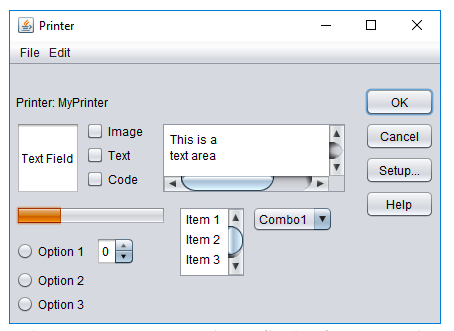
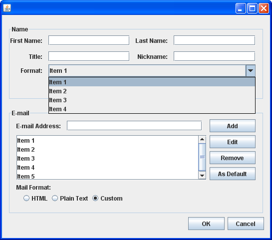
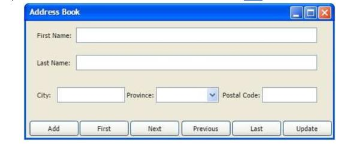

% Generics and JavaFX

# A brief recap

## Generics

* Generics in Java allow you to define classes, interfaces, and methods that can work with any data type while maintaining type safety at compile time. In other words, you can write code that can handle any type of data, without having to write separate code for each type.

Some basic use cases of generics methods in Java include:

1. Creating a method that can work with different types of collections, such as lists, sets, and maps.
2. Creating a method that can perform arithmetic operations on different numeric data types, such as integers, doubles, and floats.
3. Creating a method that can compare different types of objects, such as strings, integers, and dates.
4. Creating a method that can convert data between different types, such as converting a string to an integer or a date to a string.

Here's a simple example of a generics method that finds the minimum value in an array of comparable objects:

```java
public class test {

	public static void main(String[] args) {
		Integer[] intArray = { 1, 2, 3, 4, 5 };
		Double[] doubleArray = { 1.1, 2.2, 3.3, 4.4, 5.5 };
		Character[] charArray = { 'H', 'E', 'L', 'L', 'O' };
		String[] stringArray = { "Hello", "World" };

		System.out.println(findMin(intArray));
		System.out.println(findMin(doubleArray));
		System.out.println(findMin(charArray));
		System.out.println(findMin(stringArray));
	}

	public static <T extends Comparable<T>> T findMin(T[] array) {
		T min = array[0];
		for (int i = 1; i < array.length; i++) {
			if (array[i].compareTo(min) < 0) {
				min = array[i];
			}
		}
		return min;
	}

}
```

## JavaFX

* JavaFX is a framework for creating rich graphical user interfaces (GUIs) in Java. It is a successor to the Swing GUI toolkit.

\pagebreak

# Critical Thinking

* Which of the following statements about generic methods in Java is true?

a) Generic methods can only be used with primitive data types.
b) Type parameters in a generic method must always be declared as "T".
c) The return type of a generic method can be a different type than its parameter type.
d) Generic methods can only be called with one type argument.

_answer_: C

---

* Which of the following is a valid declaration of a generic method in Java?

a) `public void myMethod(T obj) { ... }`{.java}
b) `public <T> void myMethod(T obj) { ... }`{.java}
c) `public void <T> myMethod(T obj) { ... }`{.java}
d) `public void myMethod(<T> obj) { ... }`{.java}

_answer_: b

---

* Which of the following is NOT a benefit of using generic methods in Java?

a) Improved type safety
b) Increased code reusability
c) Better performance
d) More concise code

_answer_: C --> It may or may not improve performance, depending on the situation. **It's not necessity a direct benefit.**

---

* Which of the following is the signature of the start method?

a) `public void start(Stage stage)`{.java}
b) `public void start()`{.java}
c) `public void start(Scene scene)`{.java}
d) `public void start(Stage stage, Scene scene)`{.java}

_answer_: a

---

* Which of the following is not an absolute necessity in a JavaFX application?

a) Scene
b) Stage
c) BorderPane
d) Main method

_answer_: c

---

* The EventHandler interface specifies a method named …………. .

a) fire
b) add
c) remove
d) handle

_answer_: d

---

* All JavaFX applications must extend the class …………. .

a) Node
b) Application
c) Pane
d) Layout

_answer_: b

---

* Inspect the following simple app. A blank window is what we see when it is run, what is the problem?

```java
public void start(Stage stage) {
	Pane root = new Pane();
	Scene scene = new Scene(root, 300, 300);
	Label l = new Label("Hello World!");
	l.setStyle("-fx-font-size: 20px");
	root.getChildren().add(l);
	stage.show();
}
```

a) A Pane object cannot be the root node of a scene graph.
b) The object returned by the call to getChildren() is unmodifiable.
c) A Label object does not have a method called setStyle().
d) Stage object is unaware of the Scene object.

_answer_: d

\pagebreak

# Practice

* Write a generic method named `countOccurrences`{.java} that takes an array of elements of any type and a target element, and returns the number of occurrences of the target element in the array. The `countOccurrences`{.java} method should have the following signature:

`public static <T> int countOccurrences(T[] arr, T target)`{.java}

_Main method_
```java
public static void main(String[] args) {

	String[] strArr = {"foo", "bar", "baz", "foo"};
	Integer[] intArr = {1, 2, 3, 2, 2, 4};

	int countStr = countOccurrences(strArr, "foo"); // returns 2
	int countInt = countOccurrences(intArr, 2); // returns 3

	System.out.println(countStr);
	System.out.println(countInt);

}
```

_answer_:
```java
public static <T> int countOccurrences(T[] arr, T target) {
	if (arr == null || arr.length == 0) {
		return 0;
	}

	int count = 0;
	for (T element : arr) {
		if (element != null && element.equals(target)) {
			count++;
		}
	}

	return count;
}
```

---

* Write a generic method named swap that takes an array of elements of any type and two indices, and swaps the elements at those indices. The swap method should have the following signature:

`public static <T> void swap(T[] arr, int i, int j)`{.java}

_Main method_
```java
public static void main(String[] args) {
	String[] strArr = {"foo", "bar", "baz"};
	swap(strArr, 0, 2);
	System.out.println(Arrays.toString(strArr)); // prints ["baz", "bar", "foo"]

	Integer[] intArr = {1, 2, 3, 4};
	swap(intArr, 1, 3);
	System.out.println(Arrays.toString(intArr)); // prints [1, 4, 3, 2]
}
```

_answer_:
```java
public static <T> void swap(T[] arr, int i, int j) {
	if (i < 0 || i >= arr.length || j < 0 || j >= arr.length) {
		throw new IndexOutOfBoundsException("Invalid index");
	}

	T temp = arr[i];
	arr[i] = arr[j];
	arr[j] = temp;
}
```

---

* The following app employs an AnimationTimer object, which calls its handle() method with a frequency of around 60Hz. The input to the handle() method is a long integer which is a timestamp measured in nanoseconds (difference in timestamps of two different calls gives the time elapses between them as nanoseconds). Modify this app so that it counts one tick per second.

```java
int counter = 0;
public void start(Stage stage) {
	Pane root = new Pane();
	Scene scene = new Scene(root, 300, 300);

	Label l = new Label("Count: 0");
	l.setStyle("-fx-font-size: 20px");
	root.getChildren().add(l);
	AnimationTimer timer = new AnimationTimer() {
		@Override

		public void handle(long now) {
			counter++;
			l.setText("Count: " + counter);
		}
	};

	timer.start();
	stage.setScene(scene);
	stage.show();
}
```

_answer_:

```java
long prevTimestamp = 0;
…
public void start(Stage stage) {
…
	public void handle(long now) {
		if(now - prevTimestamp > 1000000000L) {
			prevTimestamp = now;
			counter++;
			l.setText("Count: " + counter);
		}
	}
…
}
```

---

* The following is a simple explorer app which traverses a directory tree and displays it visually. Modify it so that the font size decreases with deeper hierarchy level.

```java
@Override
public void start(Stage stage) {
	Pane root = new Pane();
	Scene scene = new Scene(root, 500, 500);

	File f = new File("path-to-a-dir");

	Accordion accordion = new Accordion();
	root.getChildren().add(accordion);
	dirTraversal(f, accordion);

	stage.setScene(scene);
	stage.show();
}

public void dirTraversal(File f, Accordion a) {
	if(f.isDirectory()) {
		Accordion aNew = new Accordion();
		a.getPanes().add(new TitledPane(f.getName(), aNew));
		for(File i: f.listFiles())
			dirTraversal(i, aNew);
	}
	else {
		TitledPane t = new TitledPane(f.getName(), null);
		t.setTextFill(Color.BROWN);
		a.getPanes().add(t);
	}
}
```

_answer_:

```java
@Override
public void start(Stage stage) {
	Pane root = new Pane();
	Scene scene = new Scene(root, 500, 500);

	File f = new File("path-to-a-dir");

	Accordion accordion = new Accordion();
	root.getChildren().add(accordion);
	dirTraversal(f, accordion, 0);

	stage.setScene(scene);
	stage.show();
}

public double computeFont(int depth) {
	return 16 - 1.5*depth;
}

public void dirTraversal(File f, Accordion a, int depth) {
	if(f.isDirectory()) {
		Accordion aNew = new Accordion();
		TitledPane t = new TitledPane(f.getName(), aNew);
		t.setFont(Font.font(computeFont(depth)));
		a.getPanes().add(t);
		for(File i: f.listFiles())
			dirTraversal(i, aNew, depth+1);
	}
	else {
		TitledPane t = new TitledPane(f.getName(), null);
		t.setTextFill(Color.BROWN);
		t.setFont(Font.font(computeFont(depth)));
		a.getPanes().add(t);
	}
}
```

\pagebreak

# Project

* Take a look at the GUI Example. Imitate the layout (don’t try to implement any logic) using Scene Builder.



_answer_: [gui_1](src/gui_solutions/gui_1.fxml)

---

* Take a look at the GUI Example. Imitate the layout (don’t try to implement any logic) using Scene Builder.

{ width=65% }

_answer_: [gui_2](src/gui_solutions/gui_2.fxml)

---

* Take a look at the GUI Example. Imitate the layout (don’t try to implement any logic) using Scene Builder.



_answer_: [gui_3](src/gui_solutions/gui_3.fxml)

---

* Take a look at the GUI Example. Imitate the layout (don’t try to implement any logic) using Scene Builder.


_answer_: [gui_4](src/gui_solutions/gui_4.fxml)
