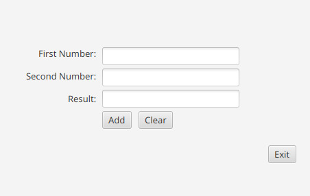
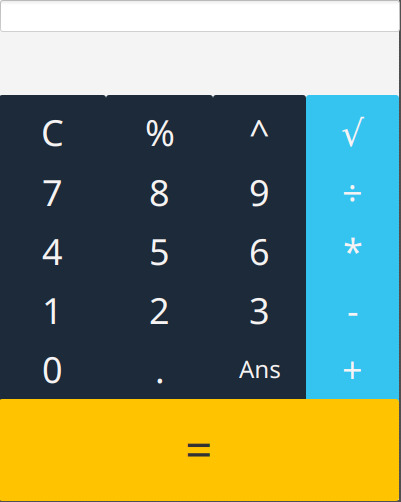

% JavaFX

# Practice

* Take a look at the GUI Example. Imitate the layout (don’t try to implement any logic) using Scene Builder.



_Answer_: [FXML code](./src/calcApp/src/application/Sample.fxml)

---

* Now implement the logic for the GUI. make a class with three methods: `add()` `clear()` and `exit()`. The `add()` method should take the two numbers from the two text fileds, add them together and display the result in the third text filed. The `clear()` method should clear all three text fields. The `exit()` method should close the application.

_Answer_:

```java
package application;

import javafx.application.Platform;
import javafx.fxml.FXML;
import javafx.scene.control.Button;
import javafx.scene.control.TextField;

public class SampleController  {

	@FXML
	TextField firstNum, secondNum, result;
	@FXML
	Button addButton, clearButton, exitButton;

	public void add() {
		int res = Integer.parseInt(firstNum.getText()) + Integer.parseInt(secondNum.getText());
		result.setText(res+"");
	}

	public void clear() {
		firstNum.setText("");
		secondNum.setText("");
		result.setText("");
	}

	public void exit() {
		Platform.exit();
	}
}
```

---

* In current stage prgram need a Main to run. Make the Main class and run the program.

_Answer_:

```java
package application;

import javafx.application.Application;
import javafx.fxml.FXMLLoader;
import javafx.scene.Scene;
import javafx.scene.layout.VBox;
import javafx.stage.Stage;


public class Main extends Application {
	@Override
	public void start(Stage primaryStage) {
		try {
			VBox root = (VBox)FXMLLoader.load(getClass().getResource("Sample.fxml"));
			Scene scene = new Scene(root,400,400);
			scene.getStylesheets().add(getClass().getResource("application.css").toExternalForm());
			primaryStage.setScene(scene);
			primaryStage.show();
		} catch(Exception e) {
			e.printStackTrace();
		}
	}


	public static void main(String[] args) {
		launch(args);
	}
}
```

\pagebreak

# Project

* Let's make a full featured calculator program. First Imitate the following layout using Scene Builder.



_Answer_: [FXML code](./src/calculator/calculator.fxml)

---

* Implement the logic for the GUI. You can follow these steps to implement the logic

1. Define package named "calculator".
2. Import necessary libraries: javafx.fxml.FXML, javafx.scene.control.Button, javafx.event.ActionEvent, javafx.scene.control.TextField, java.util.ArrayList.
3. Create a public class named "Controller".
4. Declare necessary instance variables such as "result", "holder", "newCalculation", and "previousAnswer".
5. Access FXML elements: input and resultBox using @FXML.
6. Define an initialize() method with @FXML annotation to set editable properties of input and resultBox to false.
7. Define a versatile getInput() method that handles button events with ActionEvent parameter.
8. In getInput() method, if newCalculation is true, then set text of input and resultBox fields to "" and clear holder.
9. Set newCalculation to false.
10. Get the button that was clicked and store its text in "buttonText" variable.
11. If buttonText is "C", then clear the input, resultBox, and holder and return.
12. If buttonText is a number, then check the last element in holder. If it's a number or a ".", then concatenate it with buttonText and add buttonText to holder. Otherwise, add buttonText to input and holder.
13. If buttonText is an operator, then check the last element in holder. If it's an operator, then return. Otherwise, if holder is empty and buttonText is not `√`, then add previousAnswer to the input with "Ans()" text. Finally, add buttonText to input and holder.
14. If buttonText is "Ans", then add previousAnswer to the input with "Ans()" text and add previousAnswer to holder.
15. If buttonText is "=", then call calculate() method if holder contains at least 3 elements or if holder contains `√`.
16. In calculate() method, perform the necessary calculations to obtain the answer.

_Answer_: [java code](./src/calculator/Controller.java)

```java
//Define package
package calculator;

//Define imports
import javafx.fxml.FXML;
import javafx.scene.control.Button;
import javafx.event.ActionEvent;
import javafx.scene.control.TextField;
import java.util.ArrayList;

//Start Controller class
public class Controller {

    //Declare necessary variables
    private double result;
    private ArrayList<String> holder = new ArrayList<>();
    private boolean newCalculation = false;
    private double previousAnswer = 0.0;

    //Access FXML elements
    @FXML
    private TextField input;

    @FXML
    private TextField resultBox;

    //FXML initialize method
    @FXML
    public void initialize() {
        input.setEditable(false);
        resultBox.setEditable(false);
    }

    //Versatile method that handles button events
    public void getInput(ActionEvent evt) {

        //Check if user is performing a new calculation (default value is false)
        if (newCalculation) {
            input.setText("");
            resultBox.setText("");
            holder.clear();
        }

        //Set newCalculation to false
        newCalculation = false;

        //Get the source of the button event
        Button button = (Button) evt.getSource();
        //Get text of the source button
        final String buttonText = button.getText();

        //Check if the button text is clear
        if (buttonText.equals("C")) {

            input.setText("");
            resultBox.setText("");
            holder.clear();
            return;
        }

        //Check if the button text is a number
        if (buttonText.matches("-?\\d+(\\.\\d+)?") || buttonText.contains(".")) {


            if (holder.size() > 0) {
                String previousElement = holder.get(holder.size() - 1);


                if (previousElement.matches("-?\\d+(\\.\\d+)?") || previousElement.contains(".")) {

                    holder.set(holder.size() - 1, previousElement + buttonText);
                    input.appendText(buttonText);
                    return;
                }
            }

            input.appendText(buttonText);
            holder.add(buttonText);
            return;

        }

        //Check if the button text is an operator
        if (buttonText.matches("[-+*÷^%.√]")) {

            if (holder.size() > 0) {
                String previousElement = holder.get(holder.size() - 1);

                if (previousElement.matches("[-+*÷^%.√]")) {

                    return;
                }
            }


            if (holder.size() == 0 && !buttonText.equals("√")) {
                input.appendText("Ans(" + previousAnswer + ")");
                holder.add(String.valueOf(previousAnswer));
            }
            input.appendText(buttonText);
            holder.add(buttonText);
            return;
        }

        //Check if button text is looking for the previous answer
        if (buttonText.equals("Ans")) {

            input.appendText(buttonText + "(" + previousAnswer + ")");
            holder.add(String.valueOf(previousAnswer));
            return;
        }

        //Check if buttonText is ready to perform a calculation
        if (buttonText.equals("=")) {

            if (holder.size() >= 3 || holder.contains("√")) {

                calculate();

                resultBox.setText(String.valueOf(result));
                newCalculation = true;

                previousAnswer = result;
            }

        }

    }

    //Method to perform the necessary calculations in order to obtain the answer
    private void calculate() {

        try {
            while (holder.size() > 1) {

                if (holder.indexOf("√") > -1) {

                    int index = holder.indexOf("√");

                    double right = Double.parseDouble(holder.get(index + 1));

                    double result = Math.sqrt(right);

                    holder.set(index, String.valueOf(result));

                    holder.remove(index + 1);

                }

                if (holder.indexOf("^") > -1) {

                    int index = holder.indexOf("^");
                    double left = 1, right = 1;

                    if (holder.get(index - 1).matches("-?\\d+(\\.\\d+)?")) {
                        left = Double.parseDouble(holder.get(index - 1));
                    }

                    if (holder.get(index + 1).matches("-?\\d+(\\.\\d+)?")) {
                        right = Double.parseDouble(holder.get(index + 1));
                    }


                    double result = Math.pow(left, right);

                    holder.set(index - 1, String.valueOf(result));

                    holder.remove(index);
                    holder.remove(index);

                }


                if (holder.indexOf("*") > -1) {
                    int index = holder.indexOf("*");

                    double left = Double.parseDouble(holder.get(index - 1));

                    double right = Double.parseDouble(holder.get(index + 1));

                    double result = left * right;

                    holder.set(index - 1, String.valueOf(result));

                    holder.remove(index);
                    holder.remove(index);

                }

                if (holder.indexOf("÷") > -1) {
                    int index = holder.indexOf("÷");

                    double left = Double.parseDouble(holder.get(index - 1));

                    double right = Double.parseDouble(holder.get(index + 1));

                    double result = left / right;

                    holder.set(index - 1, String.valueOf(result));

                    holder.remove(index);
                    holder.remove(index);

                }

                if (holder.indexOf("%") > -1) {
                    int index = holder.indexOf("%");

                    double left = Double.parseDouble(holder.get(index - 1));

                    double right = Double.parseDouble(holder.get(index + 1));

                    double result = left % right;

                    holder.set(index - 1, String.valueOf(result));

                    holder.remove(index);
                    holder.remove(index);

                }

                if (holder.indexOf("+") > -1) {
                    int index = holder.indexOf("+");

                    double left = Double.parseDouble(holder.get(index - 1));

                    double right = Double.parseDouble(holder.get(index + 1));

                    double result = left + right;

                    holder.set(index - 1, String.valueOf(result));

                    holder.remove(index);
                    holder.remove(index);

                }

                if (holder.indexOf("-") > -1) {
                    int index = holder.indexOf("-");

                    double left = Double.parseDouble(holder.get(index - 1));

                    double right = Double.parseDouble(holder.get(index + 1));

                    double result = left - right;

                    holder.set(index - 1, String.valueOf(result));

                    holder.remove(index);
                    holder.remove(index);

                }

            }

            result = Double.parseDouble(holder.get(0));

        } catch (RuntimeException e) {

            resultBox.setText("Calculation Error");

        }

    }
}
```
